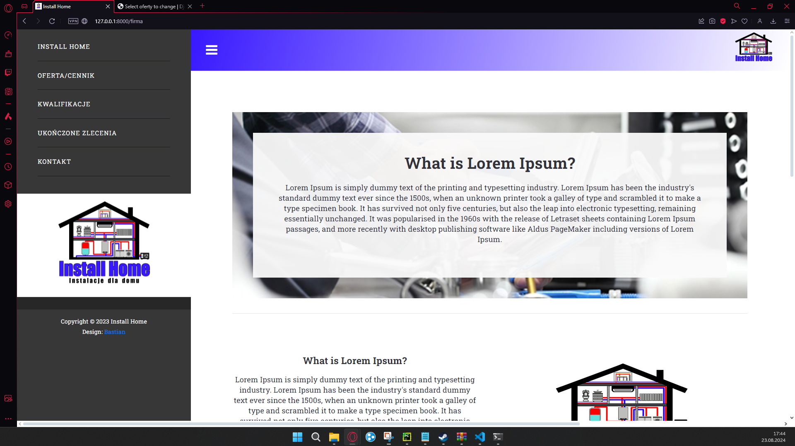
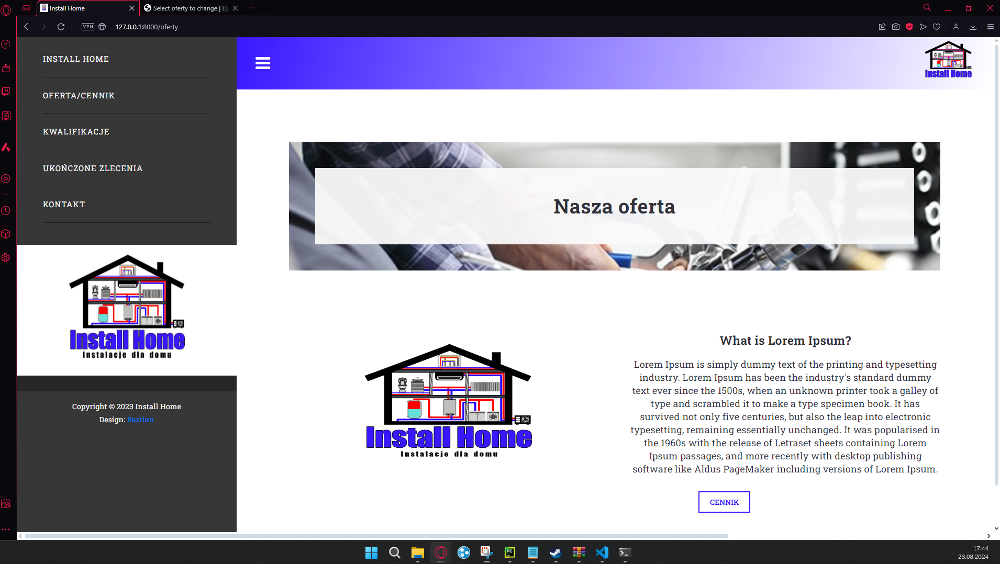
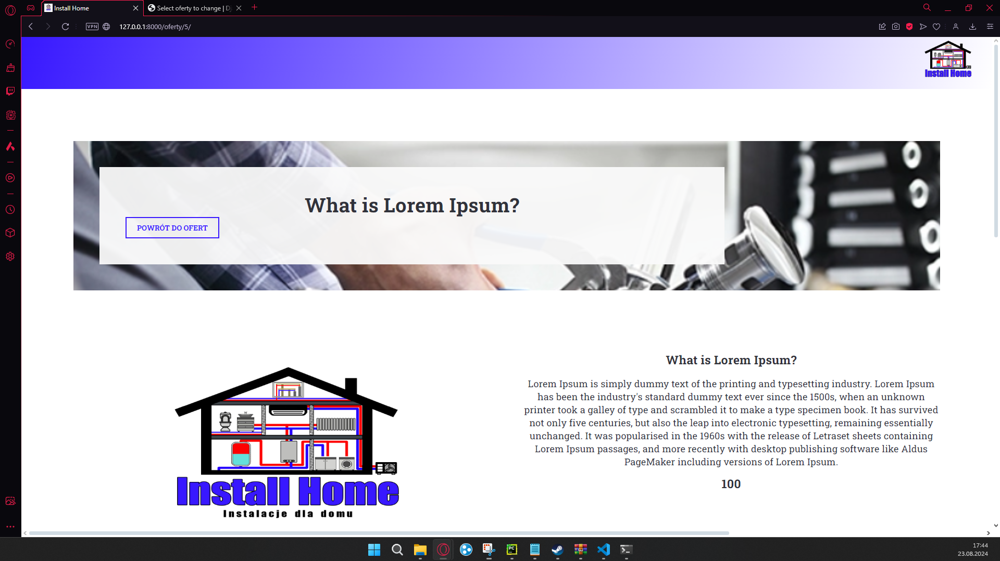
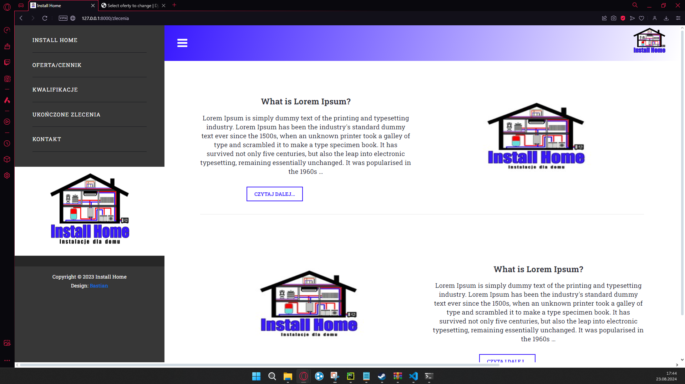
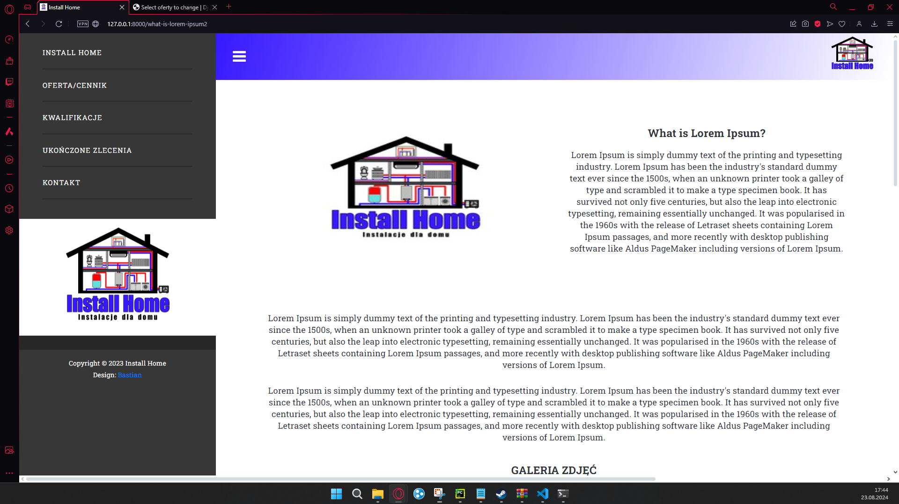
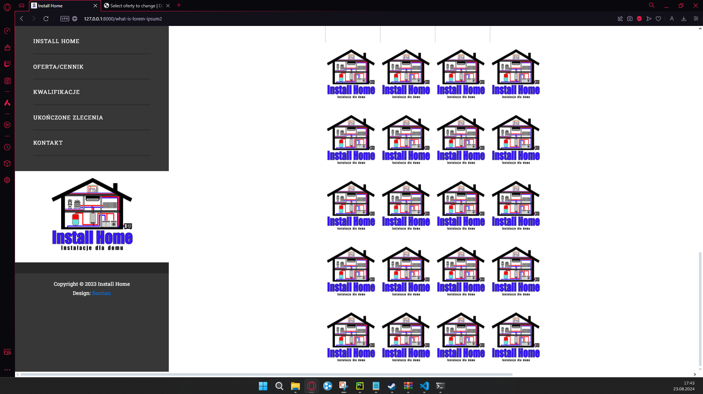
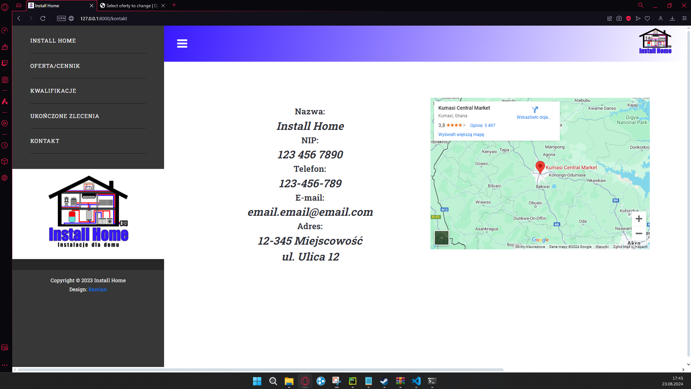

<h1>InstallHome</h1>

InstallHome to strona dla firmy zajmującej się hydrauliką oraz instalacjami domowymi. Strona pozwala firmie na dodawanie pozycji ofert firmy, tworzenie cennika, zrobienia "ściany z certyfikatami" oraz prowadzenie bloga.

<h2>Funkcjonalności</h2>
<ul>
    <li>Dodawanie pozycji ofert firmy</li>
    <li>Tworzenie cennika</li>
<li>Stworzenie strony z certyfikatami</li>
<li>Prowadzenie bloga</li>
</ul>

<h2>Technologie</h2>
<ul>
    <li>Django 3.x</li>
    <li>Python 3.x</li>
</ul>

<h2>Poniżej znajdują się zdjęcia z wiidoku przeglądarki</h2>

<h4>Widok strony głównej</h4>

<h4>Strona z cennikiem</h4>

<h4>Widok szczegółowy cennika danej kategorii</h4>

<h4>Widok z blogiem</h4>

<h4>Strona ze szczegółami danego posta</h4>

<h4>Widok z galerią zdjęć z posta</h4>

<h4>Strona z informacjami firmy</h4>

